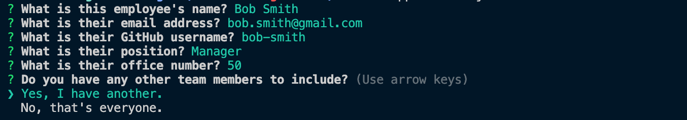
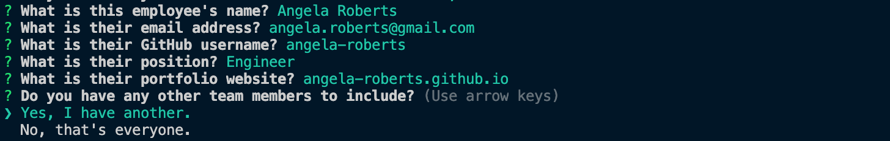
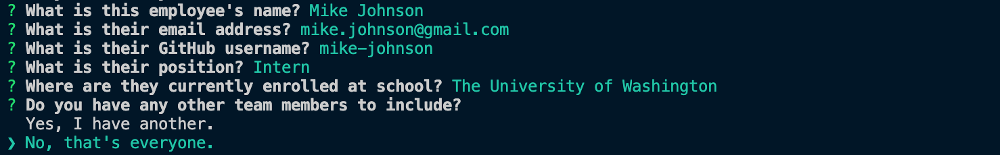
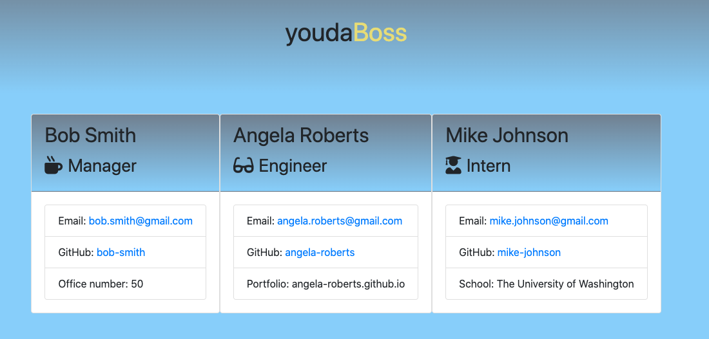

# 10-team-generator

This Node Command Line Interface (CLI) application allows a user to build a website which links to their employees' GitHub portfolio and emails. 

## Purpose

As par the University of Washington Coding Bootcamp, I created this CLI application for a user who may need to generate an html page including multiple individual profiles from a team. 

## How to use

The user start must start this application by first installing the proper dependencies. Run 'npm i' or 'npm install' to accomplish this step. 

From there, running 'node application.js' will start the application and promp the user with questions. 

Thee user will have three separate branches of questions, depending their answers. 

Each specific branch is dependent on the user's response to the question regarding the team members' role. 

See below for questions for the manager role:

See below for questions for the engineer role:

See below for questions for the intern role:

Following the inclusion of all of the team members, the user can select 'No, that's everyone' and they will be provided information about the generated html page. 

When you they view the html file that will be written to the 'output' folder, they will see a custom html page based on their inputs. 

Please note, that the file in the output folder is overwritten if the user decides to generate 

The html file can be viewed in any browswer by the user. 

## Contact Me

If you have any questions, please do not hesitate to contact me via the contact section of https://e-bossler.github.io or email me at eric.bossler@gmail.com. 

